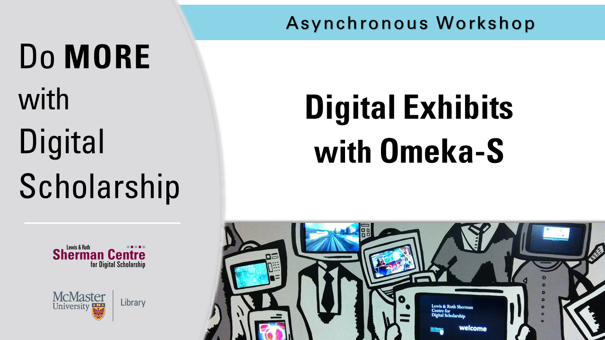

<!-- Edit the content below for the workshop in question. Once you're ready to publish, remove the comment characters e.g. "<!--" at the start and end -->

# Welcome to Introduction to Digital Exhibits with Omeka S. 

Learn how to use Omeka S to manage digital collections and create scholarly exhibits. This tutorial will introduce users to the basic functions of [Omeka S](https://omeka.org/). including how to create an archival item collection, add metadata, and build a digital exhibit.  

Proceed to the [Introduction](introduction) page to get started.

